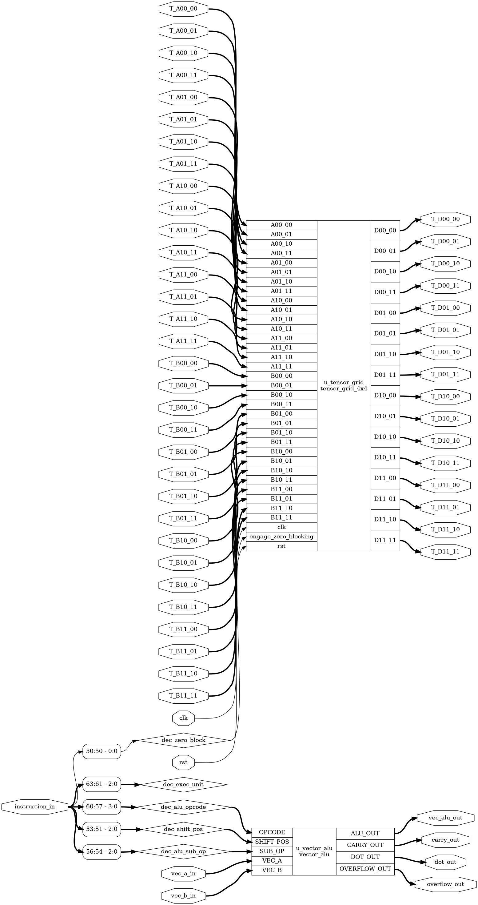
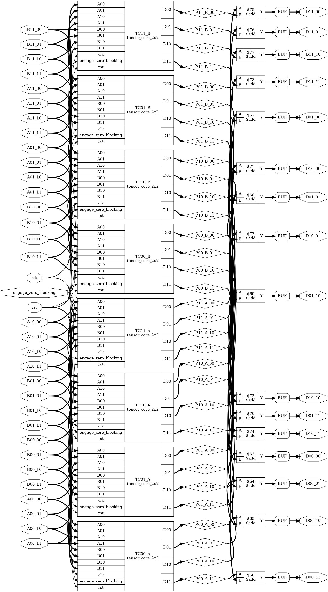
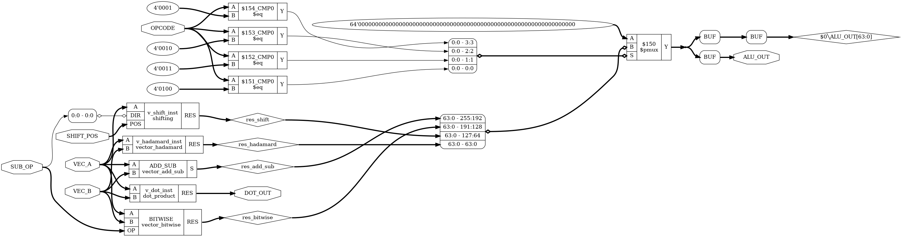

# Custom Hardware Parallel Accelerator Architecture with Tensor Cores

**Author:** Stathis Koulofotias  
**Date:** July - August 2026  
**License:** MIT

---

## Overview


A custom hardware parallel accelerator architecture written in **Verilog**, designed from scratch with a focus on demonstrating modern GPU core concepts. This project features:

- **4×4 Tensor Core Grid** — Hardware-accelerated matrix multiplication via block matrix multiplication algorithm
- **Vector ALU** — Parallel vector operations (addition, subtraction, bitwise logic, shifts, Hadamard product, dot product)
- **Zero-Block Detection** — Power optimization mechanism for sparse computations
- **Custom 64-bit ISA** — Complete instruction set architecture with field-level control
- **Full RTL Design** — Comprehensive testbenches, synthesis scripts, and documentation

This is an **educational proof-of-concept** demonstrating the fundamental principles of modern parallel accelerator architecture (similar to NVIDIA/AMD GPU design).
<br clear="right"/>

---

## Key Features & Architecture

The system is based on a **top-down modular architecture**, combining specialized units:

### Tensor Cores


`tensor_grid_4x4.v` & `tensor_core_2x2.v`

- Structured grid of four 2×2 tensor cores
- Hardware-accelerated 4×4 matrix multiplications
- Block matrix multiplication algorithm with 2-stage pipelined execution
- Programmable zero-block skipping for power efficiency
<br clear="left"/>

### Vector ALU


`vector_alu.v`

- Parallel vector operations on 64-bit vectors (8 × 8-bit elements)
- **Operations:** Addition/Subtraction, Bitwise (AND, OR, XOR, NOT, NAND, NOR, XNOR), Shifting, Hadamard product, Dot product
- Carry and overflow flag generation
<br clear="right"/>

### Zero Block Detector
`zero_block_detector.v`
- Detects all-zero blocks in input matrices
- Enables pipeline bypass for energy efficiency
- Critical for sparse matrix acceleration

### Arithmetic Foundation
- Full & half adder modules
- N-bit adder/subtractor
- Dot product module

---

## Repository Structure

```
Custom_parallel_accelerator
├── README.md                              # This file
├── LICENSE                                # MIT License
├── .gitignore                             # Git ignore rules
│
├── parameters.vh                          # Global parameters & ISA definitions
├── top_accelerator.v                      # Top-level module integration
│
├── tensor_grid_4x4.v                      # 4×4 Tensor Core grid
├── tensor_core_2x2.v                      # Basic 2×2 Tensor Core building block
│
├── vector_alu.v                           # Vector ALU dispatcher
├── vector_add_sub.v                       # Vector addition/subtraction
├── vector_bitwise.v                       # Vector bitwise operations
├── vector_hadamard.v                      # Hadamard product
├── shifting.v                             # Barrel shifter
│ 
├── dot_product.v                          # Dot product unit
├── add_sub_n_bit.v                        # N-bit adder/subtractor
├── full_add.v                             # Full adder primitive
├── half_add.v                             # Half adder primitive
├── zero_block_detector.v                  # Zero-block detection logic
│                                
├── tb.v                                   # Comprehensive testbench
│
├── Custom_parallel_accelerator_Manual.txt # ISA manual & architecture guide
│
├── yosys_tests.ys                         # Yosys synthesis script
├── generate_schematics.ys                 # Schematic generation script
│
└── zero_blocking_evaluation.pdf           # Performance & Power Evaluation
```

---

## Performance & Power Evaluation
For a detailed breakdown of the hardware evaluation, check out the `zero_blocking_evaluation.pdf`.
* **Core Metric:** Τracking **switching activity (toggling)** extracted from VCD simulation files as a direct indicator of **dynamic power consumption**. 
* **Key Findings:** The zero-blocking optimization successfully reduces switching activity by up to 14% in sparse configurations, proving its effectiveness in lowering dynamic power dissipation.

---

## How to Simulate

### Requirements
- Icarus Verilog (or another Verilog compiler)
- (Optional) Yosys for synthesis, system statistics and schematics generation
- (Optional) GTKWave for viewing waveforms as .vcd files

### Running the Testbench

```bash
# Using Icarus Verilog:

        iverilog -o tb *.v

# Run simulation

        vvp tb
```
### Running the Yosys Scripts

```bash
        yosys <script_name>.ys
```
### Viewing the waveforms

```bash
        gtkwave tb.vcd
```

The testbench demonstrates:
- Vector addition
- Dot product computation
- 4×4 matrix multiplication with tensor cores

**Note**

This testbench can be easily customized to support further functionalities. I highly recommend experimenting with other operations by providing the appropriate opcode (see `Custom_parallel_accelerator_Manual.txt`) and any other necesary modifications.

### Output example

```bash
VCD info: dumpfile tb.vcd opened for output.
Vector ALU test result:
----------------------------------------
A + B = C
A = ( 1, 4, 15, 3, 10, 8, 0, 1 )
B = ( 6, 2, 15, 2, 1, 10, 12, 2 )
C = ( 7, 6, 30, 5, 11, 18, 12, 3 )
----------------------------------------
Dot Product test result:
----------------------------------------
A . B = 337
----------------------------------------
Matrix Multiplication Result:
----------------------------------------
A x B = C
      ┌  1   1   1   1┐
  A = |  0   1   0   1|
      |  1   0   1   0|
      └  1   1   0   0┘
----------------------------------------
      ┌  2   0   1   1┐
  B = |  0   2   1   0|
      |  1   1   2   0|
      └  2   0   0   2┘
----------------------------------------
      ┌  5   3   4   3┐
  C = |  2   2   1   2|
      |  3   1   3   1|
      └  2   2   2   1┘
tb.v:223: $finish called at 115 (1s)
```

---

## License

MIT License — See `LICENSE` file for details.
