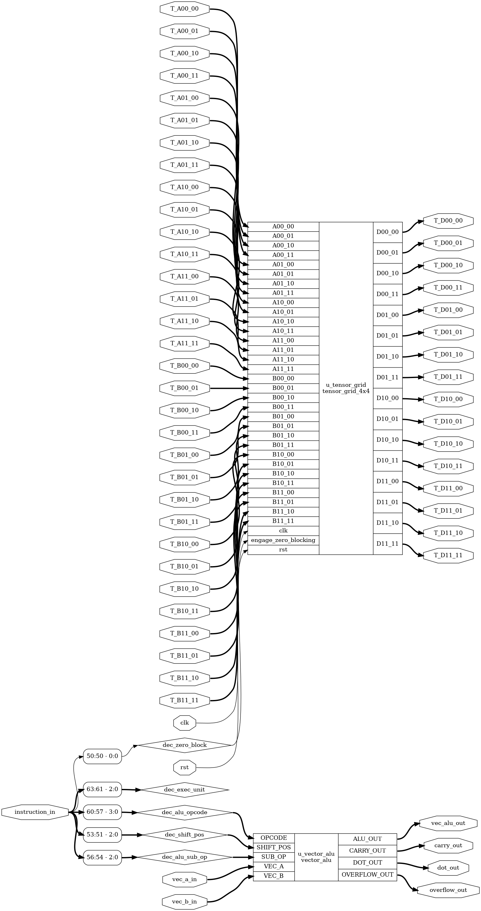
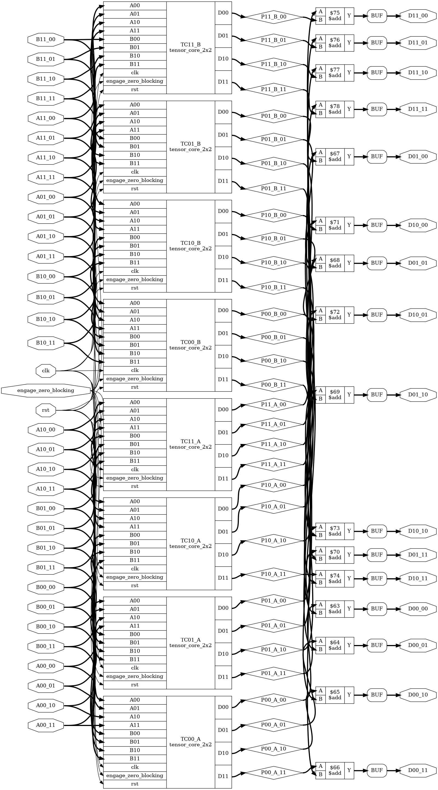
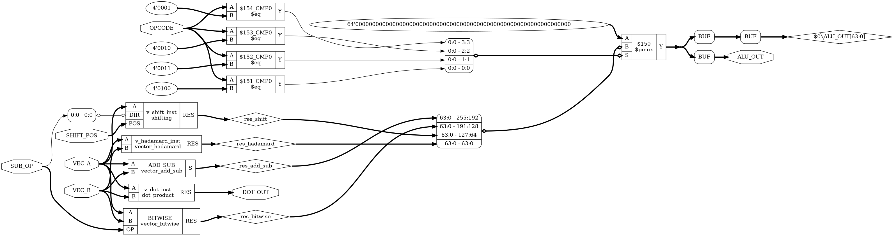

# Custom Hardware Parallel Accelerator Architecture with Tensor Cores

**Author:** Stathis Koulofotias
**Date:** July - September 2026
**License:** MIT

---

## Overview



A custom hardware parallel accelerator architecture written in **Verilog**, designed from scratch to demonstrate modern GPU core concepts. This project features:

- **4×4 Tensor Core Grid** — Hardware-accelerated matrix multiplication with MAC support ($A \times B + C$) via a block matrix multiplication algorithm.
- **Vector ALU** — Parallel vector operations (addition, bitwise logic, shifts, Hadamard product, dot product).
- **Zero-Block Detection & Gating** — Dynamic input/clock gating mechanism for sparse matrix multiplication power optimization.
- **IEEE VPI Activity Tracking** — Integrated C-based VPI module (`activity.c`) for accurate, isolated netlist switching activity (toggling) measurements.
- **Custom 16-bit ISA** — Highly optimized instruction set architecture with field-level control.
- **Full RTL & Makefile Automation** — Modular testbenches, automated Make targets, synthesis scripts, and schematics.

This is an **educational proof-of-concept** demonstrating the fundamental principles of modern parallel accelerator architecture (similar to NVIDIA/AMD Tensor architectures).
<br clear="right"/>

---

## Key Features & Architecture

The system is based on a **top-down modular architecture**, combining specialized units:

### 32-bit Streaming Datapath (`top_system.v`)
To bridge narrow external buses with wide internal registers, the system uses an organized streaming structure:
- **`top_driver.v` (Data Manager):** Manages the shared 32-bit bus and routes data based on `target_sel` signals.
- **Matrix & Vector Drivers (`matrix_driver.v`, `vector_driver.v`):** Deserializers that accumulate 32-bit slices into 64-bit vectors, 128-bit matrices (A, B), or 256-bit matrices (C).
- **`accelerator_connector.v` (Slicing Unit):** Maps unified internal registers precisely to the individual input pins of the accelerator core.

### Tensor Cores


`tensor_grid_4x4.v` & `tensor_core_2x2.v`

- Structured grid of four 2×2 tensor cores.
- Hardware-accelerated 4×4 matrix multiply-accumulate operations (MAC).
- Block matrix multiplication algorithm with 2-stage execution.
- Integrated zero-block logic gating for dynamic power reduction.
<br clear="left"/>

### Vector ALU
`vector_alu.v`
- Parallel vector operations on 64-bit vectors (8 × 8-bit elements).
- **Operations:** Addition (Subtraction via Two's Complement), Bitwise (AND, OR, XOR, NOT, NAND, NOR, XNOR), Shifting, Hadamard product, Dot product.
<p align="center">
  
</p>

### Zero Block Detector
`zero_block_detector.v`
- Detects all-zero $2\times 2$ blocks in input matrices.
- Gates internal multiplier/accumulator activity while preserving mathematical accuracy.
- Critical for sparse matrix multiplication energy efficiency.

### IEEE VPI Activity Monitor
`activity.c`
- C-based Verilog Procedural Interface (VPI) module loaded at simulation runtime.
- Tracks exact netlist value changes (toggles) per instruction step.
- Eliminates testbench background noise to reflect true silicon dynamic power efficiency.

---

## Repository Structure

```text
Custom_parallel_accelerator
├── README.md                              # Project documentation
├── LICENSE                                # MIT License
├── makefile                               # Build & simulation automation
├── parameters.vh                          # Global parameters & ISA definitions
│
├── top_system.v                           # Unified streaming wrapper (Bus + Drivers + Core)
├── top_accelerator.v                      # Main execution core (Vector ALU + Tensor Grid)
├── top_driver.v                           # Streaming Data Manager / Router
├── accelerator_connector.v                # Pin-mapping and slicing unit
├── matrix_driver.v & sub-modules          # 128-bit matrix deserializer
├── vector_driver.v & sub-modules          # 64-bit vector deserializer
│
├── tensor_grid_4x4.v                      # 4×4 Tensor Core grid
├── tensor_core_2x2.v                      # 2×2 Tensor Core building block
├── vector_alu.v                           # Vector ALU dispatcher
├── vector_add_sub.v                       # Vector addition/subtraction unit
├── vector_bitwise.v                       # Vector bitwise operations unit
├── vector_hadamard.v                      # Hadamard product unit
├── shifting.v                             # Barrel shifter
├── dot_product.v                          # Dot product unit
├── zero_block_detector.v                  # Zero-block detection & gating logic
│
├── activity.c                             # C-based IEEE VPI activity monitor
├── tb_system.v                            # Streaming verification testbench (32-bit bus)
├── tb.v                                   # Legacy direct-pin testbench
├── zero_block_eval_tb.v                   # Zero-blocking power evaluation testbench
│
├── Custom_parallel_accelerator_Manual.txt # ISA manual & architecture guide
├── yosys_tests.ys                         # Yosys synthesis script
├── generate_schematics.ys                 # Schematic generation script
│
└── zero_blocking_evaluation.pdf           # Performance & Power Evaluation
```

---

## Performance & Power Evaluation

Hardware power efficiency is evaluated using an **IEEE VPI activity monitor** (`activity.c`), which tracks logic-level switching activity strictly during active instruction execution.

- **Dynamic Power Reduction:** The zero-blocking optimization successfully reduces dynamic switching activity by up to **45%** in high-sparsity matrix workloads (75% zero tiles).
- **Architectural Trade-off:** At low sparsity (25%), a minor ~5% control logic overhead is observed due to zero-detection circuitry, which is quickly offset as matrix sparsity increases.
- **Detailed Evaluation:** For the complete experimental setup, hardware trade-offs, and methodology breakdown, refer to `zero_blocking_evaluation.pdf`.

---

## How to Simulate

### Requirements
- Icarus Verilog (iverilog, vvp, iverilog-vpi)
- GNU Make
- (Optional) GTKWave for viewing .vcd waveform traces
- (Optional) Yosys for synthesis and schematic generation

### Commands

```bash
# Functional Demo : A full instruction verification deontstrating
# - 32-bit bus loading
# - Signed vector addition & arithmetic
# - Dot product computation
# - Vector shift & bitwise operations
# - 4×4 Signed Matrix MAC (Multiply-Accumulate) with tensor cores

make demo

# Power & Activity Evaluation :
# - Compiles the C VPI module
# - Runs the dedicated benchmark testbench
# - Outputs exact toggle counts

make eval

# Build cleaning

make clean

```
### Running the Yosys Scripts

```bash
yosys <script_name>.ys
```
### Viewing the waveforms

```bash
gtkwave <tb_name>.vcd
```

### Output example

```bash
# Functional Demo
VCD info: dumpfile tb.vcd opened for output.
========================================
TEST 1: Signed Vector Addition (A + B)
----------------------------------------
A[7..0] = (10, -5, 15, -10, 3, 8, -128, 1)
B[7..0] = (5, 5, -5, 10, 2, -2, 1, 2)
OUT     = (15, 0, 10, 0, 5, 6, -127, 3)
----------------------------------------
TEST 2: Signed Dot Product (A . B)
----------------------------------------
A . B = -286
----------------------------------------
TEST 3: Vector Shift Left by 2
----------------------------------------
Shifted OUT[5] = 60
----------------------------------------
TEST 4: Signed Tensor MAC Result (A x B + C = D)
----------------------------------------
     ┌   2   -1    1    0┐
  A =|  -2    3    2   -5|
     |  -4    1    1    1|
     └   0    2   -1    2┘
----------------------------------------
     ┌   1    2   -2    1┐
  B =|   3   -1    0    2|
     |   2    0    1    2|
     └   1   -4    3    1┘
----------------------------------------
     ┌ -10   10    0    3┐
  C =|   5   -2    4    1|
     | -16    2    2   -6|
     └   1    5    3    0┘
----------------------------------------
     ┌  -9   15   -3    5┐
  D =|  11   11   -5    4|
     | -14  -11   14   -5|
     └   7   -5    8    4┘
----------------------------------------
tb.v:225: $finish called at 135 (1s)

# Power & Activity Evaluation
VCD info: dumpfile tb_tensor.vcd opened for output.
SWITCHING ACTIVITY: 497 Toggles
TEST 1: Signed Tensor MAC Result (A x B + C = D)
----------------------------------------
     ┌   2   -1    1    0┐
  A =|  -2    3    2   -5|
     |  -4    1    1    1|
     └   0    2   -1    2┘
----------------------------------------
     ┌   1    2   -2    1┐
  B =|   3   -1    0    2|
     |   2    0    1    2|
     └   1   -4    3    1┘
----------------------------------------
     ┌ -10   10    0    3┐
  C =|   5   -2    4    1|
     | -16    2    2   -6|
     └   1    5    3    0┘
----------------------------------------
     ┌  -9   15   -3    5┐
  D =|  11   11   -5    4|
     | -14  -11   14   -5|
     └   7   -5    8    4┘
----------------------------------------
SWITCHING ACTIVITY: 1106 Toggles
TEST 2: Zero Blocking ON - Matrix A with 1 Zero-Tile (A00)
----------------------------------------
     ┌   0    0    2    1┐
  A =|   0    0    3   -2|
     |   1    4   -3    2|
     └   2    1    1    3┘
----------------------------------------
     ┌   2    1    1    2┐
  B =|  -2    3    0    1|
     |   3   -3    1    0|
     └   1    2   -2    1┘
----------------------------------------
     ┌   0    0    0    0┐
  C =|   0    0    0    0|
     |   0    0    0    0|
     └   0    0    0    0┘
----------------------------------------
     ┌   7   -4    0    1┐
  D =|   7  -13    7   -2|
     | -13   26   -6    8|
     └   8    8   -3    8┘
----------------------------------------
SWITCHING ACTIVITY: 1746 Toggles
TEST 3: Zero Blocking ON - Matrix A with 2 Zero-Tiles (A00, A01)
----------------------------------------
     ┌   0    0    0    0┐
  A =|   0    0    0    0|
     |   2    1    1    2|
     └  -2    3    4   -3┘
----------------------------------------
     ┌   2    1    1    2┐
  B =|  -2    3    0    1|
     |   3   -3    1    0|
     └   1    2   -2    1┘
----------------------------------------
     ┌   0    0    0    0┐
  C =|   0    0    0    0|
     |   0    0    0    0|
     └   0    0    0    0┘
----------------------------------------
     ┌   0    0    0    0┐
  D =|   0    0    0    0|
     |   7    6   -1    7|
     └  -1  -11    8   -4┘
----------------------------------------
SWITCHING ACTIVITY: 2149 Toggles
TEST 4: Zero Blocking ON - Matrix A with 3 Zero-Tiles (A00, A01, A10)
----------------------------------------
     ┌   0    0    0    0┐
  A =|   0    0    0    0|
     |   0    0    3    2|
     └   0    0   -2    1┘
----------------------------------------
     ┌   2    1    1    2┐
  B =|  -2    3    0    1|
     |   3   -3    1    0|
     └   1    2   -2    1┘
----------------------------------------
     ┌   0    0    0    0┐
  C =|   0    0    0    0|
     |   0    0    0    0|
     └   0    0    0    0┘
----------------------------------------
     ┌   0    0    0    0┐
  D =|   0    0    0    0|
     |  11   -5   -1    2|
     └  -5    8   -4    1┘
----------------------------------------
SWITCHING ACTIVITY: 2484 Toggles
zero_block_eval_tb.v:280: $finish called at 195 (1s)

```
---

## License

MIT License — See `LICENSE` file for details.